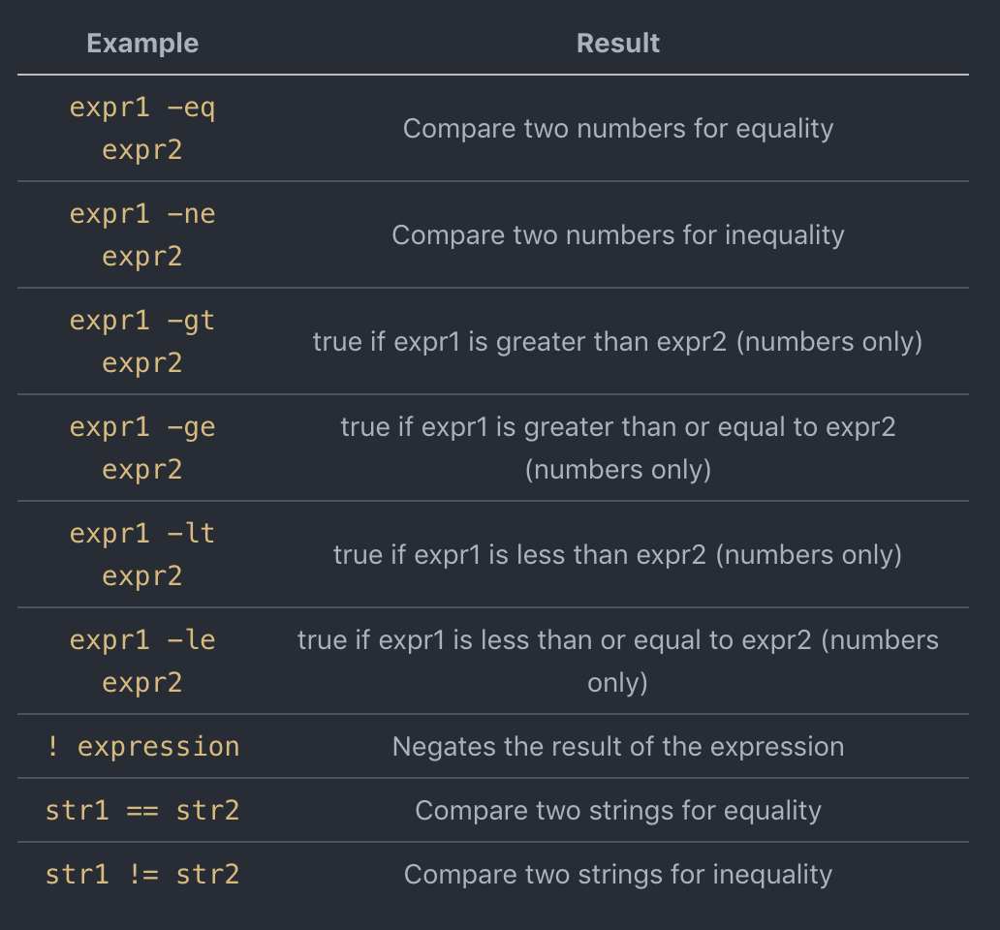

# Lab 7: Ant and Unix Scripting


<!-- This is the code for the terminal thingie at the top -->
<div class="text-left terminal type-wrap">
<div>
  <span id="command">$ </span>
</div>
<br>
<div class="readme">
  <ol>
    <li>
      This CSE 15L lab has only one component: the lab exercise!
    </li>
    <li>
      For the lab exercise, you’ll be working in a team of two: pair programming, two people to one machine. You just need to login as ONE of you, using your cs15lfa20xxx user name.
    </li>
    <li>
       Switch drivers (student on the keyboard) every 20 minutes.
    </li>
  </ol>
</div>
</div>
<!-- End of the terminal thingie at the top -->

# Goals of Completing this Lab:
* Getting familiar with Apache Ant, and experiencing examples where using it for automation and running of java applications can be useful. 
* Learn features of bash scripting that can be used to create fun basic programs, and can even help with your class scripting projects! 

# Section A: Unix Scripting

First of all, let's make sure to set up our lab directory. Everything in section A will be done under `~/Lab7/sectionA/`.
```sh
$ cd
$ mkdir Lab7
$ cd Lab7
$ mkdir sectionA
$ cd sectionA
```

## Getting Started
Unix scripting is a form of programming used to automate tasks in the terminal that may be repetitive or tedious to perform. Today, we'll be going over the basic syntax and features of scripting to enable you all to build tools to make your workflows easier!

As most programming tutorials do, we'll start off with the classic "Hello world!" program. In your terminal, type:

```sh
vim hello.sh
```

Go ahead and type this into `hello.sh`:

```sh
#!/bin/bash
str="Hello World!"
echo $str
```

Let's examine the first line. The first character sequence (#!) is known as a [shebang or hashbang](https://en.wikipedia.org/wiki/Shebang_(Unix)); it is used in Unix systems to determine which interpreter should be used to run the following script. The syntax for it goes `#!/path/to/interpreter`, and the line should **always** be the first one in the file.

Line 2 creates the variable `str` and assigns it the value "Hello World!". Notice how there are **no spaces** around the assignment operator. Bash scripting is very picky about this; if there are spaces, then it will try to run the variable as a command.

To grab the value of a Unix variable, we must use a `$`. The `$` "dereferences" the variable and grabs the value that it maps to. Without the `$`, the echo command on line 3 would print out "str" instead of "Hello World!".

There are two options for running the script. Option 1 is to specify the interpreter and use the script as an argument (e.g. `sh hello.sh`). Option 2 is to make the file executable and use the path to the executable instead (e.g. `./hello.sh`). We'll show you how to do the latter.

You should know what `chmod` does, but in case you need a reminder (check `man chmod`), it is a command to change permissions on a given file or directory. Type:

```sh
chmod u+x hello.sh
```

to change the permissions, then type:

```sh
./hello.sh
```

to run the script.

You should see the contents of `str` printed to the terminal. If you do not see this, go ahead and retry the steps above again to make sure you followed all the directions. Next, we'll move on to loops! 

**Reminder:** You need to make sure to change the permissions to any file that you want to execute as executability is not given to the user by default when creating a file. Make sure to change the permissions for the following scripts.

## Loops
Loops are essential for scaling our scripts to work on a large set of numbers, files, or to repeat a task many times. Type the following in a new shell script called `loops.sh`:

```sh
#!/bin/bash
for i in {1..100}; do
  echo $i
done
```

Pay close attention to the syntax of the `for` loop. The range of numbers is [1, 100], and there are *__exactly__* two dots in between the first number and the second number with **no spaces**. The semicolon after the closing curly is necessary only if you want the `do` on the same line as the `for` statement; so, this works just as well:

```sh
#!/bin/bash
for i in {1..100}
do
  echo $i
done
``` 

In general, semicolons are used to put more than one command on one line.

Again, save and exit from vim, then change the permissions and run the script. As expected, we see the numbers 1 through 100 printed.

Bash also has `while` loops! In the `loops.sh` file, remove the previous code and add the following code:

```sh
#!/bin/bash
ind=0
while [ $ind -lt 10 ]
do
  echo $ind
  ind=$((ind+1))
done
```

Now, let's break down what we just added. The first line assigns the `ind` variable the value 0. Note that there are no spaces between the variable name, the equals sign, and the value to assign.

The `while` loop, like in other programming languages, takes in a boolean statment and runs while the boolean value is true. In Bash, the command used to evaluate booleans is the `test` command. We're using an alias for test (`[]`) because it is easier to read and understand intuitively. **Note that there is a space between both the `[` and the `]` brackets on both sides!**

Inside the `test` command, there are a number of comparison operators that we can use to evaluate expressions. The following table lists out a few of the commonly used ones:



The line after the `echo` statement is one of many ways to increment a variable in Bash. Try experimenting on your own to find a few more!

## Conditionals
Let's see how we can use conditional statements to make our scripts even more powerful. Below, we have the skeleton for an if/else and it is your job to add it to your `loops.sh` file. Modify the if/else to print **foo** if the number is less than 5, and **bar** if the number is greater than or equal to 5.

```sh
if [ condition ]; then
    whatever you want
else
    whatever you want    
fi
```

Here are some things to note about conditionals:

1. The condition follows a similar format to that of the `while` loop.

2. The word used to indicate "else if" is `elif`, not `else if`.

3. The semicolon after the bracket serves the same purpose as it did above in the `for` loop.
 
4. `fi` is used to indicate the end of an if/else block.

After you've run your script once, go ahead and modify `loops.sh` to print "foo" for all even numbers, and "bar" for all odd numbers in the loop. (**Hint**: `$(( $ind % 2 )) -eq 0` will be helpful for the condition of the if statement!)

## Switch/Case Statements
The switch statement is another powerful programming construct that can be used as a tool in Bash. These work by looking through some number of different values a variable can hold and responding to these cases. Create a new script called `farm.sh` and enter the following code into the file:

```sh
#!/bin/bash
echo -n "Enter an animal: "
read animal

case $animal in 
   "dog") echo "woof";;
   "cat") echo "meow";;
   *) echo $animal " is not on the farm";;
 esac
```

Here are some things to note:

1. Line 2 prints the prompt to the user. The `-n` in the `echo` command removes the newline character.
2. Line 3 will require the user to enter something, and will stores the input into a variable named "animal".
3. Line 6 is where our switch statement starts. Line 7 and 8 are the possible variable values we will account for.
4. Line 9 is the default case, and will catch anything that does not match the cases above it.
5. Line 10 ends the case statement we started on line 6.
6. Take note of the ";;" (double semicolons) after each case statement.

Your task is to add three more animals to the case statement. Once you complete this task, put the switch statement in a loop so it runs forever. This means you can input an animal and your program will output the appropriate response, and prompt the user for another input. Once this is complete, move on to the next section.


# Goal: Learn about Unix Functions
## Bash Functions

As in almost any programming language, you can use functions to group pieces of code in a more logical way or practice the divine art of recursion.

Declaring a function is just a matter of writing `my_func { my_code }`.

Open `hello.sh` in vim, remove the existing code, and let's learn about functions!

Here's a basic example of a function, using the same "Hello world" message from earlier:

## Functions

```sh
#!/bin/bash
function hello {
  echo "Hello world!"
}
hello
```

Line 5 actually calls the function we wrote. Without it, the script wouldn't do anything.

## Functions with Parameters

Here's how to pass parameters into a function. We use the '$' operator to retrieve the value of the parameter, and then the number to select which argument we want. In the case of `helloWithParam`, `$1` gets the value of the first argument that was passed in, which is the string "student":

```sh
#!/bin/bash
function hello {
  echo Hello!
}

function helloWithParam {
  echo "Hello" $1
}  

hello
helloWithParam student
```

This script is almost identical to the previous one. The main difference is the arguments within functions are treated in the same manner as arguments given to the script.

# Goal: Practice Unix Scripting
## Challenge 1

Using what you learned about Unix scripting, you will write your own bash scripts.

The program you will write will take in a person's name and age from the command line and then print out if the person can vote.

Use the following output as an example. Hint: you can use $1 for the first argument passed in by the user.

```sh
$ ./canVote.sh Lubomir 21
Hello Lubomir, you can vote!

$ ./canVote Jim 7
Hello Jim, you cannot vote yet.
```

## Challenge 2
Now update the program to use `read` so that the user is prompted to enter his/her name and age. Use the following output as an example

```sh
$ ./canVote.sh
Name: Lubomir
Age: 21
Hello Lubomir, you can vote!

$ ./canVote.sh
Name: Jim
Age: 7
Hello Jim, you cannot vote yet.
```

## Challenge 3
Create a new bash script called `funWithLoops.sh` This program will read in 2 positive numbers and print out all the numbers between them. You need to handle a few errors. Keep in mind:

1. Both numbers must be positive. 
2. The numbers must be unique. 
3. The first number must be less than the second.
4. The loop runs from [first number, second number].

```
$ ./funWithLoops.sh 1 5
1
2
3
4
5

$ ./funWithLoops.sh 5 3
Error: please make sure the first number is smaller than the second
```

(Hint: For going between sequences of numbers, the `seq` command (check out `man seq`) may come in handy!)

Please complete all three challenges before moving on.

# Goal: Learn Various Unix Commands: top/ps, ping, traceroute, uptime, sleep

## top/ps

The top/ps commands are used to see what processes are running on a server or machine. It can be run from the terminal by typing:

```
$ top
```

or

```
$ ps
```

You will see various system usage information. You will also see who is running what tasks and how many resources they are using. Additionally, at the top you will see total system usage. Top is invaluable for system management and has many options to let you access a lot of data quickly. You can type `man top` to see how you can sort by memory, cpu, time, and many other fields. Press q to exit top.

## ping

The ping command is used to check if a host (or website) is up.

```
$ ping facebook.com
```

You are now pinging Facebook and it is up (hopefully). You should see "64 bytes from...." meaning that Facebook is sending back data. Go ahead and try this on different websites, and try one that is not a website to see what the error message is. You can stop pinging a server with ^C (CTRL + C).

As usual, `man ping` will give you more information about using this command.

## traceroute

traceroute is used to see where each packet is routed en route to its final destination.

```
$ traceroute yahoo.com
```

This is useful to see where your packets are going and for potential debugging of networked systems. Additionally, it gives you information about each step of the way, including that gateway's ip address and the time spent at that gateway. As usual, more information about traceroute can be found by typing `man traceroute`.

## uptime

The uptime command is used to give you various usage statistics. This can be useful in cases where ieng6 is very slow. Ideally, uptime should report numbers that are relatively low, (normally less than 3).

```
$ uptime
```

You should see the current time, how long the system has been up, the number of users, and the load average of the system over the last 1, 5, and 15 minutes. This information is available through `top` as well.

## sleep

sleep is a very simple command, but very useful for shell scripts. The purpose of the sleep command is to do nothing! You can call using the line below, replacing seconds with some number. Use a **small number** (like 0.5) so you don't waste too much time.

```
$ sleep [seconds]
```

This command is useful for situations in which you need a bit of a delay. For example, say your script performs some task, like emailing students in a loop, but sending a few hundred emails simultaneously will overwhelm your system. You could sleep for 1 second after every 50 iterations and ensure your system does not have to send too many emails at any given time. <br>

# Goal: Learn even more Unix Commands
We'll now have a (very, very brief) introduction to regular expressions. Regular expressions are a powerful tool for text and pattern matching and searching. Most programming languages come with modules built in for dealing with regular expressions (even Vim supports them!). You'll learn more about how they work in CSE 105, but for now, follow this [link](http://www.tutorialspoint.com/unix/unix-regular-expressions.htm) to familiarize yourself with the basics of regex in Unix.

### Question 1: What is the use of these special symbols in regular expression: `^`, `$`, `.` and `*`?

### Question 2: How do you make `sed` delete the first line of a file and print the rest of the file?

### Question 3: Write a UNIX command using `cat` and `sed` that finds all the lines starting with "alpha" and then deletes them.

### Question 4: Write what this regular expression matches: `/[tT]he/`

### Question 5: Write what this regular expression matches: `/^$/`


# Section B: Ant Build Tool
For section B, we will use the java files of Tetris Project:

```sh
$ cd ~/Lab7
$ mkdir sectionB
$ cd sectionB
$ cp -r ~/../public/Lab7/Tetris/* .
```

* Make sure to change directories into Section B. Section B of this lab will give you some hands-on training with the Ant Build Tool. [Apache Ant](http://en.wikipedia.org/wiki/Apache_Ant) is a Java library and command-line tool that helps with [automating software build](http://en.wikipedia.org/wiki/Build_automation) processes.
* It is similar to [Make](http://en.wikipedia.org/wiki/Make_(software)), but it is best suited for building Java projects.
* The most immediately noticeable difference between Ant and `make` is that Ant uses [XML file format](http://en.wikipedia.org/wiki/XML) to describe the build process and its dependencies, whereas `make` uses [Makefile format](http://en.wikipedia.org/wiki/Makefile#Makefiles). `make` uses Makefiles; Ant uses a file named `build.xml`.
* More information on XML syntax for Apache Ant and Project Build Management [here](https://www.tutorialspoint.com/ant/index.htm)
* More background on XML as well as syntax [here](https://www.sitepoint.com/really-good-introduction-xml/)
* A short tutorial on Ant is available [here](http://ant.apache.org/manual/index.html)
* Syntax comparisons will be provided between Makefiles and XML to spot similarities

## Setup:

1. Now open IntelliJ IDEA by clicking on __Applications --> Programming --> IntelliJ IDEA Community Edition__. If you do not have
this shortcut on your computer, follow the instructions in "Launching IntelliJ" under [Lab 3](http://ieng6.ucsd.edu/~cs15x/labs/lab3_asdfkq/index.html).

2. Click "Open", then select your Lab7 directory you copied

3. Next, click File --> Project Structure In the Project tab, set the __Project SDK__ to 1.8, __Project language level__ to 8, and the __Project compiler output__ to the `bin` directory inside of `sectionB` (If the `bin` does not exist, create one)

4. Next, click the Modules tab and mark `sectionB/src` as a source folder.

5. Now, click on Main.java. Try right-clicking Main, then click `Run Main.main()`. The project should run build and run. __If it does not, you probably did _not_ follow step 3 correctly!__

6. Now, right-click the `Lab7` directory in the side bar, then go to New --> File. Name your file `build.xml`

# Working with build.xml
In a `build.xml` file, you can identify different chunks of code that automate instructions with `<target>`, similar to targets in a Makefile. A task is a line of execution code within the target automation. One task could depend on another task.

__Before getting started:__ Take a look at the sample build.xml [here](http://en.wikipedia.org/wiki/Apache_Ant#Example). You will write a similar `build.xml` file. Note how first the project name is defined, followed by several Ant tasks that start with keyword **target**, and how all of these **target** tasks are written in between the project open and close tags.


**Step 0**: Open your build.xml file if not already. Input the below XML declaration. The XML declaration is a processing instruction that identifies the document as being XML. All XML documents should begin with an XML declaration: 

```xml
<?xml version="1.0" encoding="UTF-8"?> 
```

**Step 1**: Define your project name in `build.xml`

The second line in this xml file defines the project name and default target to be executed if no default target is defined. If no default target is defined, the first target will be executed. In your `build.xml`, define your project using:

```xml
<project name="Lab7Tetris" default="jar" basedir=".">
```
Note that IntelliJ will show an error at the end of line 2, marked by the red line that says "Unexpected End of File"  where you've just added this line of code; don't worry! This is normal. If you look to the reference completed XML file, ``` <project> ``` needs ``` </project>  ``` after it, kind of like the closing curly brace of a class.

The default target automation is `jar` which you will define later. The base directory `.` is defined as the current directory, where `build.xml` resides.


**Step 2**: The reason we use the `<property>` tag, or variables, is to reference longer names more easily. Here, the variable `src.dir` is alias to the `src` directory. The variable `project.name` holds the value "Lab7AntProject". Define variables for directory names, and project names (make sure to put this inside the project open and close tags) as follows:

```xml
<property name="src.dir" location="Tetris/src" />
<property name="build.dir" location="build" />
<property name="project.name" value="Lab7AntProject" />
```

Makefile (for comparison): The equivalent to using `<property>` to define directories in `build.xml` would be these macros in a Makefile:

```make
src.dir = "src"
build.dir = "build"
project.name = "Lab7AntProject"
```

## Question 6: Using the above examples, how would you define a new variable that stores the location of a directory named `bin`?

**NOTE**:

XML:  
To access the value of a variable, or "call" it, you use the `$` sign with `{}`. For example: `"${build.dir}"` accesses the `build` directory. 

Makefile (for comparison):
`$(build.dir)` accesses the `build` directory.  

**Step 3**: Define the `clean` target. This target __deletes the build directory__. Fill in the blanks in the code below for your `build.xml` clean target. Make sure to call the `build.dir` variable instead of the `build` directory by name itself.

```xml
<target name="clean">
  <delete dir="______________" />
</target>
```

Makefile (for comparison):
```make
clean:
  rm -rf ______________
```

***Step 4***: Define the `makedir` target. This target creates three directories: build, build/jars and build/classes under the current directory defined by the `basedir` variable (when you defined the project name). Fill in the blanks in the code below (again, try to call the `build.dir` variable instead of the `build` directory by name itself):

```xml
<target name="makedir">
       <mkdir dir="______________" />
       <mkdir dir="______________" />
       <mkdir dir="______________" />
 </target>
```

Makefile (for comparison):
```make
makedir:
  mkdir ______________
  mkdir ______________
  mkdir ______________
```

**Step 5**: Define the `compile` target. This target depends on clean and makedir target. This target compiles all the `.java` source code files in the source directory using the `javac` UNIX command. It then copies the `.class` files into the directory `classes` that was made during the `makedir` target. Fill in the blanks in the code below:
```xml
<target name="compile" depends="______________,______________">
       <javac srcdir="______________" destdir="______________" compiler="javac1.8"/>
</target>
```

Makefile (for comparsion) for `compile` with dependencies is as follows:
```make
compile: ______________ ______________
```

## Question 7: What does srcdir stand for? How about destdir?

**Step 6**: Define the `jar` target. The Java ARchive (JAR) file format enables you to bundle multiple files into a single archive file. Typically a JAR file contains the class files and auxiliary resources associated with applets and applications (see [this link](http://docs.oracle.com/javase/tutorial/deployment/jar/) for more details).

This target depends on `compile` target. In this target, you will bundle all class files that were compiled from the `compile` target into a single `.jar` file (named after your project) using the `jar` UNIX command. The file path to the jar file we want to create should be **./build/jars/Lab7Tetris.jar**. The destination jar files should be stored in folder `jars` under the `build` directory. In this target, the `basedir` is where the .class files are stored. Fill in the blanks in the code below.

```xml
<target name="jar" depends="______________">
       <jar destfile="______________" basedir="______________" />
</target>
```

The last line of your `build.xml` should mark end of current project:

```xml
</project>
```

**Step 7**: Once your `build.xml` file is ready, click "Ant Build" on the right side of your IntelliJ window to expand it. __Drag your `build.xml` file from your Project Window on the left side into the "Ant Build" window on the right side (you may have to click on it).__ Click the play button underneath "Ant Build" or the hammer to build your project.
 
 Some warnings may flash at the bottom, you can ignore these. __(Note that you should only see warnings not errors)__ The default target `jar` will run due to it being the default field in the project definition. On the first run, it will trigger the target that it depends on. Check out the `classes` folder and the `jars` folder under `build` in your project window to ensure that all targets were completed.

## Question 8: How would you delete a directory with the property name "extras" in a build.xml file?

# The following section is bonus enrichment for practicing your Bash scriping skills

This section will help you be more familiar with Bash for your upcoming scripting assignments

## Goal: Implement 🅱️ubble Sort in 🅱️ash

Bubble sort is an elementary sorting algorithm used for sorting numerical values. It's not very efficient, but it's easy to implement and understand. So, the last task we have for you is to implement 🅱️ubble sort in 🅱️ash! Here's the psuedocode:

```
func bubbleSort(arr: array of integers, n: size of array)
   for (index = 0; index < n-1; index++)      
       // Last i elements are sorted
       for (bubble = 0; bubble < n-index-1; bubble++) 
           if (arr[bubble] > arr[bubble+1])
              swap arr[bubble] and arr[bubble+1]);
```

Copy the following starter code into a file called `./bubblesort.sh`:

```sh
#!/bin/bash

#Sort an bash array using Bubble Sort

# Array to Sort
arr=(420 3 10 22 4 99 100 2 123 42)
# Get size of array
size=${#arr[@]}

# C style Bash for-loop
for ((index = 0; index < $size; index++))
do
    # At i'th iteration right most i elements are sorted and in place.
    for ((bubble = 0; bubble < $size - index - 1; bubble++))
    do
        if ((${arr[bubble]} > ${arr[$((bubble+1))]}))
        then
        # Swap the correct elements.
        # XXX YOUR CODE GOES HERE FIXME
        
        fi
    done
done

echo "Sorted Array: "
echo ${arr[*]}
```

Delete the line under "Swap the correct elements" and fill it in to finish off the algorithm!

For your reference, the output should look like this:

```
Sorted Array:
3 4 10 22 42 99 100 123 420
```

If you're having trouble with scripting syntax, just take a look at the code that was already provided for you.

You are now done with this lab!

Please fill out this feedback form so that we can improve the lab for future students! https://goo.gl/forms/yJ4nU5nLJvpSY5kz2

# Checkoff Criteria

* Show your completed challenges
* Show your sorted array output
* Show your README with the completed 8 questions
